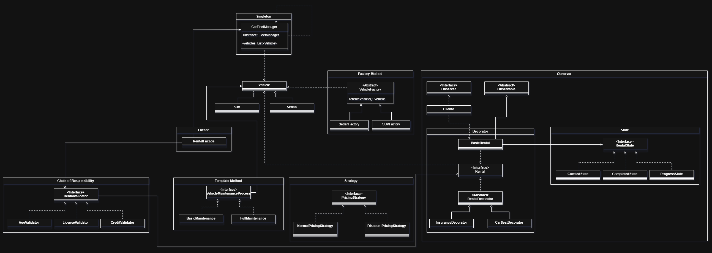

Aqui está o README atualizado conforme suas instruções:

### README

# Sistema de Gerenciamento de Aluguel de Veículos - Padrões de Design

Este repositório contém a implementação de um sistema de gerenciamento de aluguel de veículos, utilizando diversos padrões de design do livro "Design Patterns: Elements of Reusable Object-Oriented Software" (GoF). O sistema foi desenvolvido para demonstrar a aplicação de 9 padrões de design, sendo eles:

- **Singleton**: Gerenciamento da frota de veículos.
- **Factory Method**: Criação de veículos (carros e SUVs).
- **Decorator**: Adicionais no aluguel de veículos (GPS, seguro).
- **State**: Gerenciamento dos estados do processo de aluguel (reservado, em andamento, concluído, cancelado).
- **Observer**: Notificação sobre o status do aluguel (clientes e funcionários são notificados).
- **Strategy**: Estratégias de precificação de aluguel (normal, com desconto).
- **Template Method**: Processo padronizado de manutenção dos veículos (manutenção básica, manutenção completa).
- **Chain of Responsibility**: Validação de clientes para aluguel (validação de idade, carteira de motorista e crédito).
- **Facade**: Facade para simplificação do sistema de aluguel.

## Diagrama UML

O diagrama de classes UML do sistema pode ser visualizado abaixo:

---
